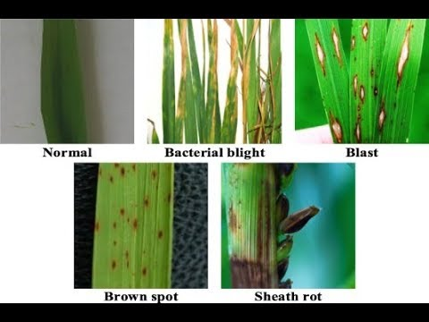
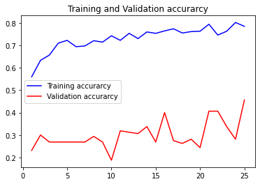
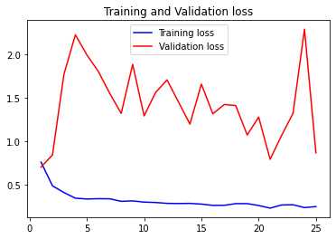

# Plant_Disease_Detection

## Machine learning project which using CNN  
To detect the disease in the given leaf image of a rice plant.  
Trained on the Plant vilage dataset.  
https://www.kaggle.com/datasets/emmarex/plantdisease

## Results

